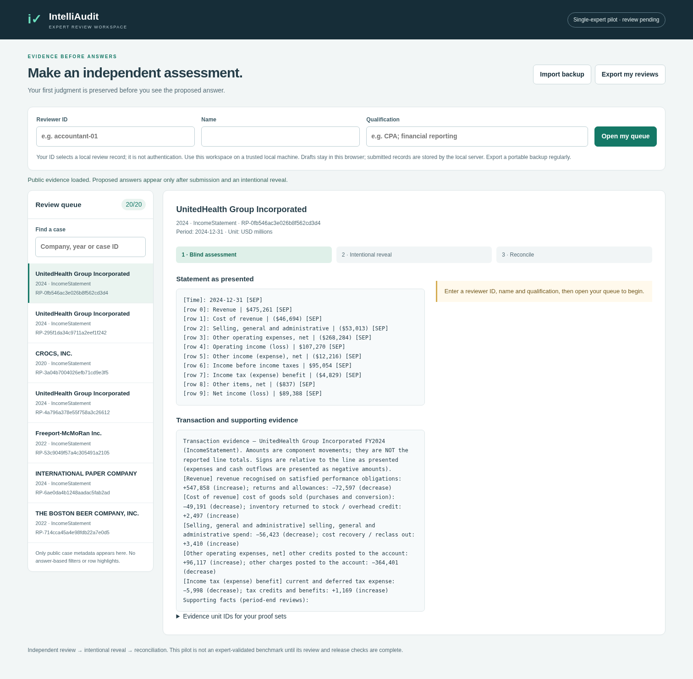

# IntelliAudit: evidence and accounting review

This branch (`codex/accountant-review-dashboard`) owns dataset construction,
provenance, and accountant review. The companion
[capstone branch](https://github.com/dakshkashyap/financial-audit-capstone/tree/research/evidence-audit-2026)
owns model methods, frozen evaluation, costs, results, and the paper.

**Current status: development, expert review pending.** The new 20-case pilot
covers five companies and one narrow revenue-cutoff family. No completed
accountant reviews or validated gold-standard results are claimed. Existing
US-GAAP/IFRS labels remain provisional. Automated checks and reference-linkbase
membership do not establish accounting correctness.

Start with [TEAM_HANDOFF](docs/TEAM_HANDOFF.md),
[research plan](docs/RESEARCH_PLAN.md), [annotation protocol](docs/ANNOTATION_PROTOCOL.md),
and [release gates](docs/RELEASE_GATES.md).

## Start the blind review

Python 3.9+; dashboard and review tools use the standard library.

```bash
git switch codex/accountant-review-dashboard
python dashboard/server.py
# Open http://127.0.0.1:8080
```

The default workspace presents the review pilot without proposed answers,
rule IDs, corrected statements, or answer-based filters. Enter a stable reviewer
identifier and qualifications. Save the initial judgment, cited evidence and
reasoning before explicitly revealing a proposal. Reconciliation is a separate
record; it does not overwrite the initial judgment. Export backups regularly.
The local server stores review events in `reviews/reviews.sqlite3`.

One accountant is available. This is a single-expert workflow; it provides no
inter-rater reliability estimate. The curator must collect **all 20 initial
judgments and the delayed repeat subset before any answer reveal** to reduce contamination between related
cases. The UI requires a saved initial review per case, but this whole-pilot
embargo is an operational protocol. Keep the reviewer away from source keys,
curator files and model outputs during the first pass.

The server is a local trusted-team tool, not an authenticated hosted service.
Reviewer IDs are attribution labels, not login accounts. HTTP blind views reduce
accidental answer exposure; anyone with repository/filesystem access can inspect
committed curator proposals. Distribute only the blind packet to the reviewer.
Do not expose the server on a public interface.

For legacy answer-visible dataset inspection, use a separate curator session:

```bash
python dashboard/server.py --curator --port 8090
```

Legacy browser-local reviews are answer-visible verification records. They cannot
be imported as independent blind judgments. The benchmark data files are not
modified by dashboard review.



## Pilot and reproducibility

`data/review_pilot/manifest.json` records selection rules, source commit and hashes.
The 20 items are ten matched-source clean/fault cases plus ten versions with one
revenue-cutoff fact withheld. Source evidence can differ beyond the manipulated
fact; these are **not certified minimal counterfactual pairs**. Withholding a
fact does not prove that the remaining evidence is insufficient. The accountant
must assess that question. Company names anchor source figures, not real fraud.

```bash
python -m unittest discover -s tests -v
python scripts/build_review_pilot.py --help
python scripts/check_release_readiness.py --help
python scripts/build_annotation_packet.py --help
```

Use a fresh output directory when rebuilding the pilot. Record-level annotation
validation and release readiness are separate: a structurally valid unreviewed
template must still fail the release gate. Dashboard events also need curation
into the full provenance/applicability schema before release; saving a review is
not automatic gold certification.

## Existing source datasets

| Dataset | Companies | Items | Clean controls | Provisionally citable |
|---|---:|---:|---:|---:|
| US GAAP | 70 | 14,963 | 1,989 | 6,388 |
| IFRS (balance sheets only) | 31 | 1,382 | 161 | 648 |

Of the US-GAAP citable labels, 5,025 carry an explicit unvalidated tag; 1,363 have
reference-linkbase associations, which are also not expert applicability review.
All 648 IFRS labels are unvalidated. Financial figures are SEC-derived;
transactions and supporting facts are synthetic. Source accession consistency,
residual/template artifacts and citation validity remain open issues.
See [datasheet](docs/DATASHEET.md) and [known issues](KNOWN_ISSUES.md).

The existing generator commands remain available for construction research:

```bash
python scripts/build_benchmark.py --offline
python scripts/split_dataset.py
python scripts/check_triviality.py
python scripts/identifiability_check.py
python scripts/make_dataset_card.py
```

These commands can overwrite generated artifacts: run in a separate checkout
when reproducing historical data. A shortcut gate passing is a regression check,
not proof that the task is realistic or difficult. Reproducibility depends on
pinned inputs/caches; online SEC data may change.

## Research and release boundary

Our hypothesis is that a benchmark combining evidence sufficiency, acceptable
proof alternatives, dated citation applicability and budgeted investigation can
measure supported decisions better than answer matching alone. Individual
components already occur in prior work. Novelty and model gains remain to be
established. Paid model experiments are paused until review informs a frozen
protocol. Use only one frontier family and cheap/open-weight comparators.

Inherited code/data redistribution rights and standards-text permissions remain
unresolved. Public access to company filings is not a blanket public-domain
license. No new blanket license is granted by this documentation. The December
target is a defensible release and submission-ready preprint, not guaranteed
conference acceptance. See the companion paper and measured results before
quoting performance.
