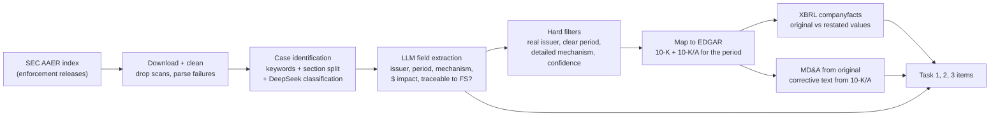

# AuditFraudBench: what it does, what it found, what we take

> Liu, He, Ou, Zhu, Guo, Peng, Ananiadou. *AuditFraudBench: Benchmarking Audit
> Judgment in Detecting Fraudulent Misstatements.* arXiv:2606.08345, submitted
> 6 June 2026. University of Manchester, Columbia, Rutgers, Edinburgh, The Fin AI.
> [arXiv](https://arxiv.org/abs/2606.08345) · [HTML](https://arxiv.org/html/2606.08345)

Section numbers below (§2.1, Table 2, App. C.3) point to the arXiv HTML version.

## In one paragraph

Most finance benchmarks ask whether a number or a sentence is wrong.
AuditFraudBench asks a harder question: when a company committed fraud, can a
model see that management's *story* about its results was misleading, even when
every sentence is technically true? Gold labels come from the SEC's own
enforcement findings (AAERs) and the company's later restatement, not from an
LLM or an annotator's opinion. The headline result: models get the yes/no label
right on easy setups but almost never explain the real fraud mechanism, and they
miss misleading passages that work by leaving things out.

## 1. The problem they target (§1)

Fraud rarely looks like a typo. The paper's framing:

> "figures may be internally consistent, while management attributes performance
> changes to sustainable operations when the true driver is revenue timing,
> expense deferral, reserve release, one-time gains, or accounting estimate
> manipulation" (§1)

> "MD&A narratives may mislead not through explicit falsehoods, but through
> selective emphasis, omitted context, or favorable framing" (§1)

They place prior work in two groups (App. A, Table 3):

| Group | Examples | What they test | What they miss |
|---|---|---|---|
| Audit benchmarks | FinAuditing, *Automating Financial Statement Audits* (AuditBench, Wang et al. 2025a), FinRule-Bench, FinMaster | XBRL consistency, statement errors, rule violations, workflows | Misleading narratives, true driver vs stated driver |
| Financial misinformation | Fin-Fact, FinDVer, FISCAL, MFMD-Scen, RFCBench | Claim truth, document consistency | Not grounded in audited filings or enforcement cases |

AuditBench (Wang et al. 2025a) is the benchmark IntelliAudit was built to fix.
Table 3 lists it as "Statement error", with partial filing coverage and no
narrative, fraud pattern, or enforcement evidence.

## 2. How the data is built (§2.2)

Key mechanics:

- **Source of truth is the SEC's decision.** AAERs "typically contain the
  investigated entity, the period during which the violation occurred, the
  accounting treatment involved, the financial impact of the misconduct, and the
  final enforcement conclusions" (§2.2.1).
- **Original vs corrected pairing.** Each case is matched to the original 10-K
  and, when one exists, the amended 10-K/A for the same entity and period.
  Without a 10-K/A the case still feeds Tasks 1 and 3; Task 2 gets a placeholder
  (§2.2.2, "Alignment and Pairing").
- **Numbers come from XBRL companyfacts**, aligned "by reporting period and
  filing version" to get original-vs-restated deltas. Cases before the XBRL
  mandate (2009+) have no structured numbers (§2.2.2, "Sample Construction").
- **An LLM is in the labelling loop.** DeepSeek does case classification and an
  LLM pipeline extracts the structured fields; flagged samples go to manual
  review with "automated rule-based quality inspection + manual spot checking"
  (§2.2.2).

### Size (Table 1)

| Item | N | Fraud pattern (Task 3) | N |
|---|---|---|---|
| Companies | 84 | Revenue Timing | 110 |
| Unique AAER cases | 84 | Accounting Estimate | 107 |
| 10-K filings | 143 | Expense Deferral | 37 |
| 10-Q filings | 136 | Narrative Distortion | 23 |
| 20-F filings | 16 | Earnings Smoothing | 18 |
| **Task 1 items** | **34** | **Task 3 items** | **295** |
| **Task 2 items** | **294** | | |

The paper states: "all Task 1 instances involve attribution errors, and all
Task 2 narratives are misleading" (§2.3). There are no negative examples in
Tasks 1 or 2.

## 3. The three tasks (§2.1, §2.3)

| Task | Input | Output | Plain-language question |
|---|---|---|---|
| 1. Profit Source Attribution | Original financials, restated financials, management's explanation | Correct / Misleading + the true driver | "Management says profit rose because of demand. Is that the real reason?" |
| 2. Misleading Narrative Detection | One MD&A passage | Misleading / Not + why (omission, emphasis, framing) | "Is this passage misleading even if nothing in it is false?" |
| 3. Fraud Pattern Classification | AAER misconduct description | One of 5 categories + why | "What kind of manipulation is this?" |

Task 3 categories (§2.3.3): Revenue Timing, Accounting Estimate, Earnings
Smoothing, Expense Deferral, Narrative Distortion. When a case has several,
annotators pick "the dominant mechanism based on the enforcement record."

Prompts are in App. D. All three ask for JSON with a label and a short
explanation.

## 4. How they score (§3)

- Models: GPT-5.5, GPT-4.1, DeepSeek-V4-Pro / Flash, Qwen3.5 8B and 32B, each
  with and without reasoning. Temperature 0 (§3.1).
- Labels: Accuracy, Precision, Recall, Macro-F1.
- Explanations: ROUGE-1 and ROUGE-L, reported two ways (§3.2):
  - **ROUGE-conditional**: only over items where the label was right.
    "Is the explanation good *when* the model got the answer?"
  - **ROUGE-gated**: wrong label means explanation score 0, averaged over all
    items. "Did the model get the answer *and* the reason?"

The gated version exists to stop "explanations attached to incorrect labels from
receiving inflated scores due to superficial lexical overlap" (§3.2).

## 5. Results (Table 2, selected)

| Model | T1 Acc | T1 ROUGE-1 (gated) | T2 Acc | T2 F1 | T3 Acc | T3 F1 |
|---|---|---|---|---|---|---|
| GPT-5.5 | 1.000 | 0.249 | 0.041 | 0.039 | **0.522** | **0.484** |
| GPT-4.1 | 1.000 | 0.233 | 0.061 | 0.058 | 0.478 | 0.320 |
| DeepSeek-V4-Flash | 1.000 | 0.235 | 0.065 | 0.061 | 0.420 | 0.355 |
| DeepSeek-V4-Pro | 0.971 | 0.203 | 0.058 | 0.055 | 0.495 | 0.319 |
| Qwen3-32B-R | 0.971 | 0.197 | **0.245** | **0.393** | 0.505 | 0.334 |
| Qwen3-8B | 1.000 | 0.208 | 0.041 | 0.078 | 0.505 | 0.362 |

## 6. Findings, one by one

### F1. A single-class task makes accuracy meaningless

Every Task 1 item is "Misleading", so a model that always says "Misleading"
scores 100%. Five models hit 1.000. The authors say this "should be interpreted
carefully, because all Task 1 cases involve attribution errors" (§4.1).

### F2. Right label, wrong reason

Even the best Task 1 explanation reaches only 0.249 ROUGE-1. In the MQ
Associates case (App. C.3.1), GPT-5.5 rejects management's story only because
it talks about 1997–2000 while the restatement is for 2002. It never names the
actual scheme: an understated receivables allowance built with a cash-trend
method. The paper calls the rationale "superficial."

### F3. Omission blindness: models check claims, not completeness

Task 2 accuracy is 4–25% even though every passage is misleading. The paper's
diagnosis (App. C.3.2):

> "Its reasoning strategy is assertion-checking, not completeness-checking, and
> therefore systematically misses omission-based fraud."

Models also read candid language ("our growth lagged the market") as a sign of
honesty. In the Tribune case the passage reports 2% revenue growth and omits
circulation fraud; the model calls it "straightforward, factual" (App. C.2.2).

### F4. Shortcuts on surface anomalies

In the Premier Financial Bancorp case, both models call the passage misleading
for the wrong reason: it lists about \$62M of total assets against \$332M of
loans, which is impossible for a bank. The real fraud was hidden loan losses and
fictitious loans. The paper warns that "had the passage been numerically
consistent, the model might have rated it as not misleading" (App. C.3.2).

A bank's loans cannot exceed its assets five times over, so the \$62M figure is
most likely a typo or an extraction error in the passage itself. That would make
this a data-quality problem that hands the model a shortcut. Several passages
also include "table-of-contents debris" (App. C.2.2).

### F5. Keyword anchoring and category collapse

DeepSeek-V4-Flash puts every Narrative Distortion case and 54.8% of Expense
Deferral cases into Revenue Timing (App. C.1). In the Tribune case, the phrase
"fictitious sales" appears in both the case text and the Revenue Timing
definition, so both models pick Revenue Timing. The gold label is Narrative
Distortion, because inflated circulation is an operating metric, not a GAAP
revenue line (App. C.3.3).

### F6. Gold explanations in the wrong format

For Task 3, the gold explanation is mostly a list of violated statutes
("Exchange Act §§ 13(b)(2)(A)…"). Models explain the mechanism instead, so
ROUGE is near zero even when the label is correct. The paper calls it "a
structural mismatch between the model's output (accounting rationale) and the
benchmark's ground truth (legal citation)" (App. C.3.3).

### F7. Bigger or "reasoning" models don't reliably help

GPT and DeepSeek do not consistently beat Qwen. Going from 8B to 32B "does not
guarantee improvement", and reasoning variants help only on Task 2 and only in
some families (§4.1). The authors conclude the benchmark "requires specialized
financial and accounting reasoning beyond general model scale."

### F8. Limits they admit (Limitations section)

- Small: 84 cases, 34 Task 1 items.
- US SEC only.
- **Not interactive**: the tasks "do not fully capture the interactive and
  iterative nature of real audit procedures, where auditors request additional
  evidence, consult working papers, and revise judgments over time."
- ROUGE does not measure whether an explanation is correct or faithful.

## 7. Our critical read

What they do well:

- Gold labels come from SEC enforcement decisions, the most defensible source
  of "this was fraud" available.
- Original vs restated pairing is a clean way to get *real* misstatements, not
  synthetic ones.
- Gated scoring is a simple, honest metric design.

Weak spots worth naming in a talk:

1. **No negatives in Tasks 1–2.** Accuracy there measures bias, not skill (F1).
2. **The evidence is pre-assembled with hindsight.** Task 1 hands the model the
   restated numbers. An auditor in 2002 did not have the 2005 restatement.
3. **The same model family labels and is tested.** DeepSeek classifies cases
   during construction (§2.2.2) and is also evaluated.
4. **Passage hygiene.** TOC fragments and implausible numbers can create
   shortcuts (F4).
5. **One hop per item.** Each task is one input packet and one answer. Nothing
   requires connecting weak signals across documents.

## 8. What we take for IntelliAudit

| # | Approach from the paper | What it means for us | Where | Effort |
|---|---|---|---|---|
| A | F1: single-class labels inflate accuracy | Our exam has the same flaw: all 1,202 items are "Incorrect", so "General Judgment" is free. We already have 220 clean statements in `data/benchmark/statements_clean.jsonl`. Mix a share into the exam and report detection on both classes. | `scripts/split_dataset.py`, `src/scorer.py` | Small |
| B | §3.2 gated scoring | Add gated metrics: row credit only if the error type is right, citation credit only if the row is right. Stops a model getting citation points for a guessed rule on the wrong line, or for listing many rules at once. | `src/scorer.py` (`score_citation`, `score_detection`) | Small |
| C | §2.2 AAER → EDGAR → XBRL original vs restated | A **real-misstatement split**: take AAER cases, pull the original 10-K and the 10-K/A, diff companyfacts by accession. The changed concept is a real Numerical Error with a known row and value. Gold mechanism comes from the AAER, not from our injector. | reuse `src/edgar_ingest.py`; new `scripts/build_restatement_split.py` | Medium |
| D | §2.3.3 fraud pattern taxonomy | Add a `mechanism` field to the answer key so we can compare with AuditFraudBench. See the mapping below. | `src/injector.py`, answer key schema | Small |
| E | F3: assertion-checking vs completeness-checking | Our weakest error type is the same idea: Missing Row (on a 54-item sample the capstone's deterministic stage caught 2 of 12). Add an explicit "what should be here" check from the filing's own presentation structure (e.g. a cash flow that does not start with net income). | `src/filing_structure.py`; auditor pipeline Stage 0 | Medium |
| F | §2.3.3 "dominant mechanism" rule; F5 boundary confusion | Write tie-break rules for our own boundaries: Misclassification vs Redundant Row, Numerical vs Missing Row, R07 identity break labelled Numerical. Put them in the citation policy so annotators and models see the same rule. | `docs/CITATION_POLICY.md` | Small |
| G | F6: gold must match the output format | Keep one gold paragraph per item in the same format we ask for (`ASC 606-10-25-23`). Do not mix statute lists or multi-code sets into the scored field. | `docs/CITATION_POLICY.md`, answer key | Small |
| H | F4: shortcuts from extraction debris | Extend the leakage check to flag impossible values (e.g. a subtotal far larger than its parent) and any non-statement text in `statement_text`. | `scripts/check_triviality.py` | Small |
| I | F8: ROUGE does not measure correctness | For "Error Resolution", score the corrected value numerically (we know the true value) instead of text overlap. | `src/scorer.py` | Small |

### D. Mapping our rules to their fraud patterns

| IntelliAudit rule | AuditFraudBench category | Note |
|---|---|---|
| R09 revenue recognition timing | Revenue Timing | Direct match |
| R15 AFS securities measurement | Accounting Estimate | Fair-value judgment |
| R11 inventory, no NRV write-down | Accounting Estimate **or** Expense Deferral | Their definitions overlap: "impairment judgments" is listed under Accounting Estimate, "delayed impairment recognition" under Expense Deferral |
| R14 goodwill impairment omitted | Accounting Estimate **or** Expense Deferral | Same overlap |
| R01–R03, R08, R10 misclassification | None | Their taxonomy has no presentation-error category. These are a gap they don't cover |
| R04, R05, R06, R07, R12 | None | Generic errors, not fraud mechanisms |

Two talking points come out of this table. Their five-way taxonomy is itself
ambiguous for impairment cases. And IntelliAudit covers presentation and
classification errors that AuditFraudBench does not.

## 9. What it does not do (bridge to the next ideas)

| Gap | Paper evidence | Next idea |
|---|---|---|
| Each item is one packet, one answer | §2.1 task definitions | Hidden multi-hop fraud chains |
| The model never chooses what evidence to get | Limitations: "do not fully capture the interactive and iterative nature" | Interactive evidence acquisition under a budget |
| Explanations scored by word overlap, not by which evidence was used | §3.2, Limitations | Evidence-graph process evaluation |

## 10. One-minute version for the talk

1. **What:** a fraud benchmark whose gold comes from SEC enforcement releases,
   paired with the original and restated filings.
2. **Three tasks:** is management's reason for the results honest; is this
   passage misleading; what kind of fraud is this.
3. **Finding:** models get easy labels, miss the mechanism, and miss fraud that
   works by omission. They check whether sentences are false, not whether
   something important is missing.
4. **Caveat:** Task 1 has only misleading items, so its 100% accuracy is
   meaningless. Our own exam has the same issue, and we can fix it.
5. **What's missing:** no interaction, no evidence path, one hop per item.

## References

- AuditFraudBench, arXiv:2606.08345 — §1 framing, §2.2 construction, Table 1
  statistics, §3.2 gated metrics, Table 2 results, §4.1 analysis, App. C error
  analysis, App. D prompts, Limitations.
- Wang et al. 2025a, *Automating Financial Statement Audits with Large Language
  Models*, arXiv:2506.17282 (AuditBench, the dataset IntelliAudit replaces).
- Wang et al. 2025b, *FinAuditing*, arXiv:2510.08886.
- SEC Accounting and Auditing Enforcement Releases:
  https://www.sec.gov/enforcement-litigation/accounting-auditing-enforcement-releases
